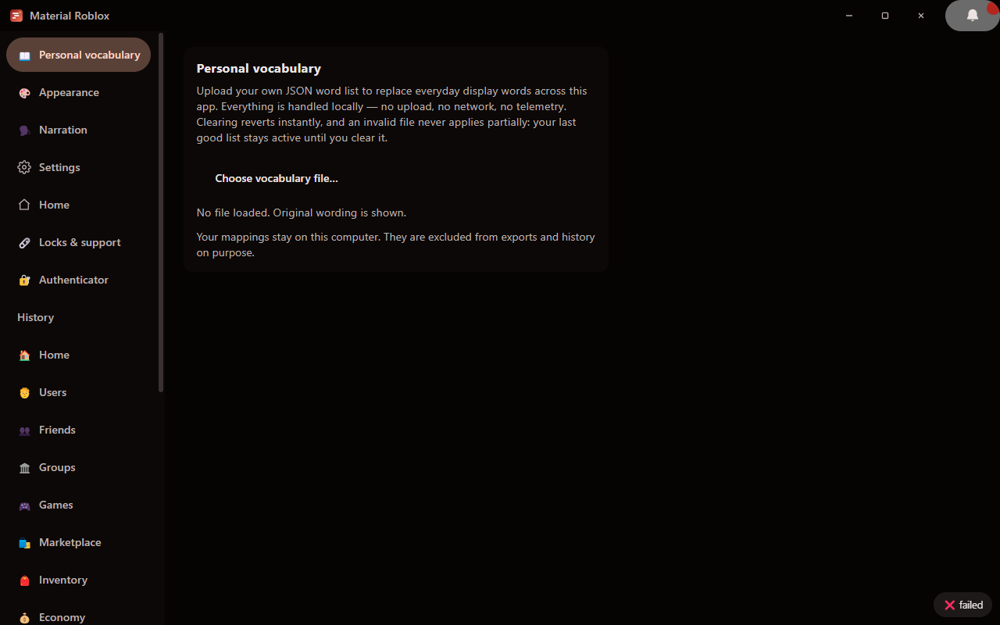
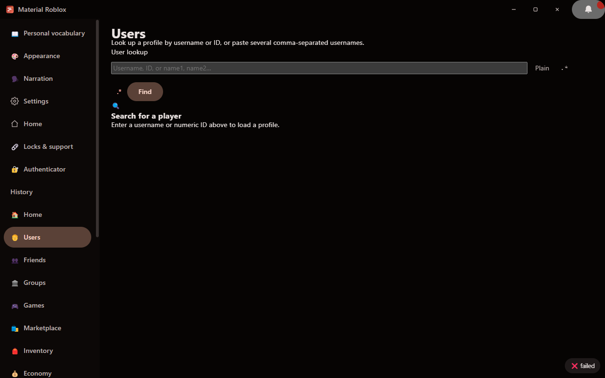
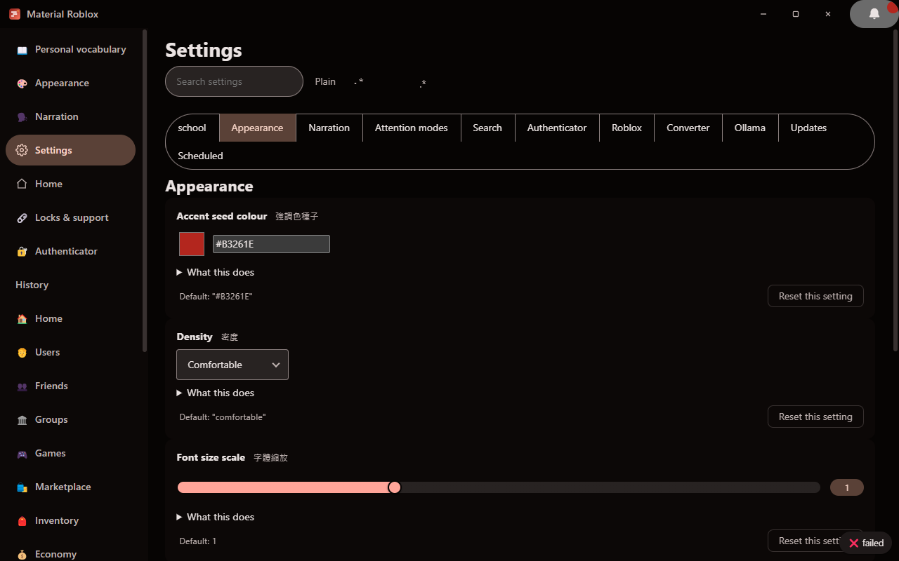
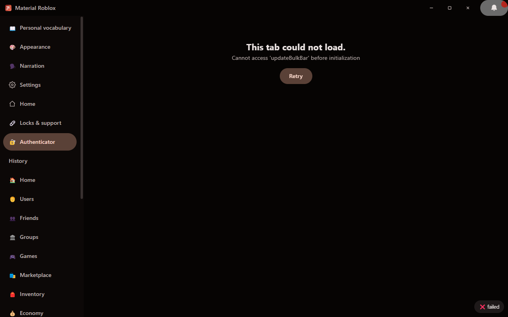
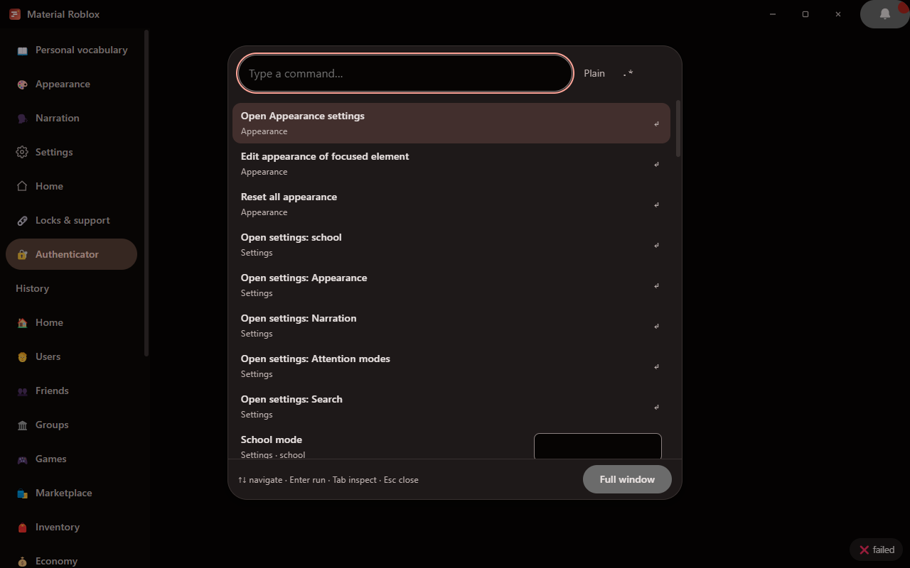
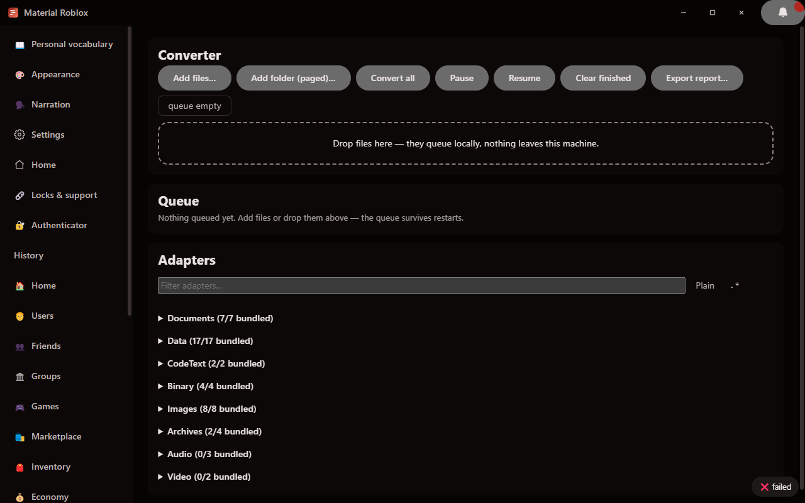

# Material Roblox

<p align="center">
  
</p>

**Material Design 3 desktop explorer for the Roblox platform APIs.**
Browse users, friends, groups, games, marketplace, and inventories through a
fast, local, privacy-respecting Windows app — no account required for public
data, nothing phoning home.

| | |
| --- | --- |
| **Install** | [Download the latest installer](https://github.com/Ding-Ding-Projects/material-roblox/releases/latest/download/MaterialRobloxSetup.exe) *(appears once the first release publishes)* |
| **Website & docs** | https://ding-ding-projects.github.io/material-roblox/ |
| **License** | MIT |
| **Platform** | Windows 10+ x64 |

  

> **Unsigned installer notice:** by permanent project policy this app is never
> code-signed. Windows SmartScreen may warn about an unknown publisher — choose
> *More info* → *Run anyway* if you trust the build. Nothing here claims
> signature verification.

## Contents

- [Features](#features)
- [Screenshots](#screenshots)
- [Build from source](#build-from-source)
- [Architecture](#architecture)
- [Development contract](#development-contract)
- [Engineering rules for agents](#engineering-rules-for-agents)
- [Human-time estimate](#human-time-estimate)
- [Line counts](#line-counts)
- [FAQ](#faq)
- [License](#license)

## Features

<details open>
<summary><strong>Everything the app ships</strong></summary>

**Roblox explorer** — user lookup with avatar renders · friends/followers
lists with bulk export · group info, roles, and public shout walls · game and
universe details with stats and badges · catalog/marketplace search with
filters and limited/serial info · public inventories by asset type ·
economy + presence surfaces behind an opt-in session · two-user compare ·
session manager storing your cookie in the OS credential vault.

**Interface** — dockable browser-style tab strip (pin, groups, discovery
searches, bulk close, persistence) · `Ctrl+Shift+F` command palette with rich
setting rows and teleport-to-element · full regex builder anchored beside every
search field, dropdown, and context menu · non-blocking notifications with a
reviewable centre · bulk actions on every list · exports in JSON, JSONL, YAML,
TOML, XML, CSV, TSV, Markdown, HTML, SQL, and ZIP · Git-backed local history
with date/action filters · in-app changelog viewer with calendar filter and
commit links.

**Appearance** — full Material Design 3 conformance · light/dark/system themes
· density control · accent seed via an infinite colour picker (continuous
picker, bidirectional colour-space translator, animated rainbow option) ·
word-processor-depth typography editing · per-element *Edit appearance…* on
every surface · app-logo presets plus bounded local custom-logo conversion.

**Safety** — destructive-action super confirmation (two independent keys plus
a full-range slider) · per-element toy locks with honest self-service recovery
· unlock ladder that clears waiting without ever clearing credentials ·
built-in RFC 6238 authenticator with in-process QR pairing · Support Tickets
desk that never sends anything anywhere.

**Personalization** — English / playful Cantonese / bilingual modes ·
independent funny-level sliders per language · School mode (one shared,
renamable switch) · personal vocabulary upload · opt-in narrator with
per-language voice pickers · five ADHD accommodations · dim sum surprise ·
scheduled settings with external sources.

**Platform** — local file converter with a categorized adapter catalog ·
Ollama suite manager (exhaustive local catalog, evidence-backed hardware-fit
verdicts, batch pulls) · Chrome-style auto-updater over an unsigned feed ·
CI-counted line statistics in every release · status reporting · Open Graph
embed graphic.

</details>

## Screenshots

Real built-artifact captures, taken 2026-08-22 from the actual running app
(built from `lane/captures` @ `8362077`) through the cheap Lowlevel headless
desktop route — the app was launched on an off-screen Windows desktop with
`--remote-debugging-port` and photographed via per-window capture; every PNG
was pixel-verified non-uniform after capture. A machine-readable record of
each capture lives in
[docs/screenshots/MANIFEST.json](docs/screenshots/MANIFEST.json).

<details>
<summary>Capture matrix — six surfaces (click to expand)</summary>













</details>

**Failed state, honestly pending:** the Authenticator tab cannot render its
healthy QR-pairing surface — it throws
`Cannot access 'updateBulkBar' before initialization`
(`src/js/core/authenticator.js` calls `updateBulkBar()` at lines 472/481
before its `const` definition at line 526). The capture above records the
real error state; Retry reproduces it deterministically.

Also still pending (not part of the six-state matrix above): a populated
Roblox user profile card (the capture sandbox has no Roblox network access)
and the colour picker with the rainbow sentinel active.

| Surface | State to capture |
| --- | --- |
| Roblox user lookup | populated profile card |
| Colour picker | rainbow sentinel active |
| Authenticator | QR pairing screen (blocked by the `updateBulkBar` defect above) |

## Build from source

```bat
git clone https://github.com/Ding-Ding-Projects/material-roblox.git
cd material-roblox
build.bat
```

`build.bat` installs every dependency it needs (Node, npm packages, Electron
runtime) into user-scoped locations, then builds and offers to run the app.
`build.bat /s` runs the same path silently for CI and agents.
`build-installer.bat` produces the same unsigned Squirrel installer the
release workflow publishes.

| Script | Purpose |
| --- | --- |
| `scripts/ensure-electron.mjs` | Materialize the pinned Electron binary |
| `scripts/gen-icons.mjs` | Generate app icon assets |
| `scripts/gen-social-preview.mjs` | Draw + byte-verify the Open Graph image pair |
| `scripts/count-lines.mjs` | The exact line-count table releases publish |
| `scripts/build-changelog.mjs` | Changelog data from git tags |
| `scripts/build-docs-index.mjs` | Docs index + site copy of feature articles |
| `scripts/release-meta.mjs` | Release tag + once-per-project dim-sum code name |
| `scripts/fetch-fonts.mjs` | Optional complete font vendoring (never run by CI) |
| `scripts/check-vocabulary.mjs` | Vocabulary hash lock method (see below) |

## Architecture

Electron 33 with a vanilla-JS ES-module renderer — no UI frameworks, no CDN
assets, everything bundled at build time. The main process owns all network
access through an allowlisted proxy channel; the renderer talks to it via one
validated generic bridge. Secrets live only in the OS credential vault.
Module boundaries, IPC channels, and export contracts are specified in the
[development contract](docs/dev/CONTRACT.md).

## Development contract

All lanes work from [`docs/dev/CONTRACT.md`](docs/dev/CONTRACT.md) — the single
source of truth for ownership maps, IPC channel names, core-module exports,
bootstrap order, CSS conventions, i18n conventions, and accessibility minimums.
If code and contract disagree, one of them is fixed in the same change.

## Engineering rules for agents

See [AGENTS.md](AGENTS.md) — a sanitized mirror of the shared engineering rules
governing work in this repository (ordinary English only; the canonical rules
live elsewhere).

## Human-time estimate

> **Estimate — not a measurement.** Nobody built this by hand; the figure below
> is arithmetic on counted lines, shown so the scale is checkable rather than
> asserted.
>
> **Method:**
> ```
> hand-written lines (from scripts/count-lines.mjs, exclusions stated)
>   × assumed rate: 200 lines/hour for routine UI code
>   × 1.6 multiplier for the parts that are genuinely harder than their size
>     (crypto, TOTP/QR, sandboxed conversion, i18n breadth)
>   = person-hours  →  ÷ 160 = person-months
> ```
>
> **Result (from release v1.0.0-build.7):** 42,620 non-blank hand-written
> project lines ÷ 200 × 1.6 ≈ **341 person-hours ≈ 2.1 person-months**.
> Arithmetic: 42620 / 200 = 213.1 h; × 1.6 = 341 h; ÷ 160 h/month ≈ 2.13 months.
> The inputs come from the same counted lines the release publishes, so the
> estimate and the count cannot disagree. Treat it as an estimate, not a fact.

## Line counts

Latest published figure — [release v1.0.0-build.7](https://github.com/Ding-Ding-Projects/material-roblox/releases/tag/v1.0.0-build.7):
**47,593 project lines (42,620 non-blank)** across 152 files — app source 32,244 · styles 5,583 · site 4,558 · docs 3,040 · scripts 1,770 · workflows 330. Tests are deliberately absent in this pass and the table says so.

Every release publishes the full table (per-area lines, non-blank lines,
exclusions with reasons, and agent-vs-human attribution by surviving
`git blame` lines). Reproduce locally:

```bat
node scripts\count-lines.mjs
```

## FAQ

**Is this affiliated with Roblox Corporation?**
No. Material Roblox is an independent, open-source explorer of publicly
documented platform APIs and is not affiliated with, endorsed by, or connected
to Roblox Corporation.

**Why is the installer unsigned?**
Permanent project policy: no certificates, no signing services, ever. The
trade-off is stated everywhere it matters — SmartScreen will warn, and the
release notes say so plainly rather than claiming authenticity.

**Does it need an account?**
Only for the economy and presence surfaces. Everything else works with public
data; connecting a session is optional, clearly explained, and revocable in
one click.

**Where does my data go?**
Nowhere. No telemetry, no analytics, no crash reporting. Network access is
allowlisted to Roblox API hosts and this repository's own Releases.

## License

[MIT](LICENSE) — © 2026 Ding-Ding-Projects and contributors.
